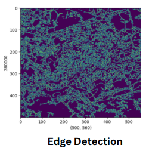
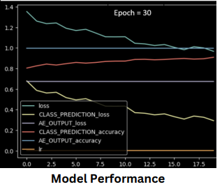

# Martian-Terrain-Identification-Using-Computer-Vision
## *CNN Computer Vision Image Processing*

The primary objective of this project is to implement Deep Learning Algorithms on a conceptual Mars Surveillance UAV Design, to allow the model to Classify and distinguish the Martian Terrain.
The images were pre-processed and a VGG16 CNN Model was implemented to train and test the dataset. Datasets from previous Rover missons were used and over 25 categories were considered. The performance of the model was compared by testing the model with different Epochs.
A Mars UAV Design was conceptualized after a thorough analysis of the environmental conditions on Mars and a literature review of existing models were deduced.

The purpose of an Unmanned Aerial Vehicle in Mars is its Capability of accessing areas inaccessible by a rover like caves, Craters. The UAV can be used to
detect suitable landing sites for future Mars Missions.

*However, this is a preliminary level project conducted to understand the application of Deep Learning. The model must be refined and trained further to obtain accurate results.*

### Dataset Characteristics:
*Number of Images*: The dataset consists of 6691 images collected by the Mars Science Laboratory (MSL) rover.
*Instruments Used:* The images were captured using three instruments: Mastcam Right eye, Mastcam Left eye, and MAHLI (Mars Hand Lens Imager).
*Image Characteristics*: The images in the dataset are the "browse" version of each original data product, not full resolution.
Each image is roughly 256x256 pixels.

*Labels:* Twenty-four classes identified by a Mars rover mission scientist.
Classes exhibit heterogeneity, captured from different angles, magnifications, backgrounds, and illumination. Examples include instruments (APXS, drill, DRT, MAHLI), calibration targets (CT), and rover parts (observation tray, inlet, scoop, wheel). Non-rover classes: ground and horizon.

### Image Preprocesing
*Pre-processing techniques used:*
- Pixel Brightness transformations/ brightness corrections
- Geometric transformation
- Image Filtering and Segmentation
- Fourier transform and Image restoration

### Model Performance
*Performance Paramters*: Accuracy, Precision, Recall, Mean Squared Error

